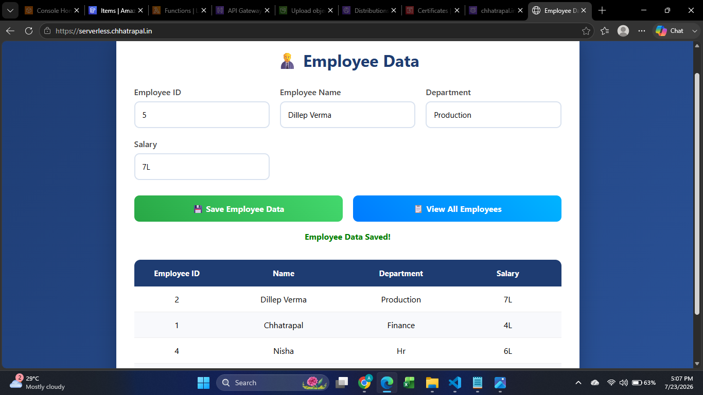
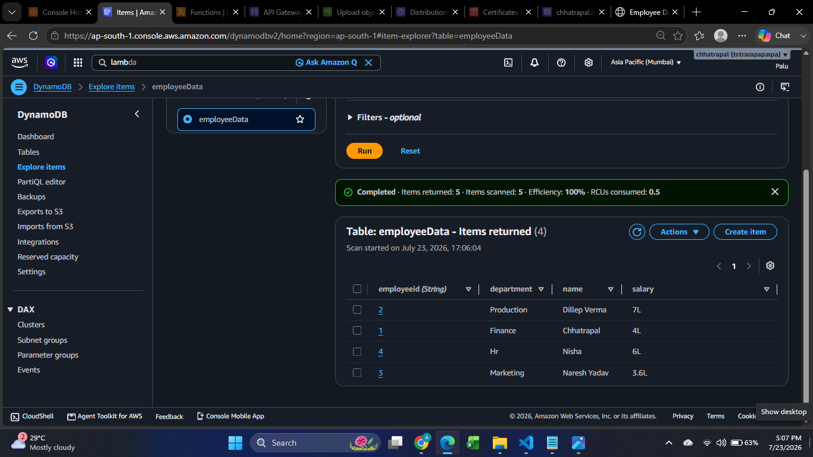
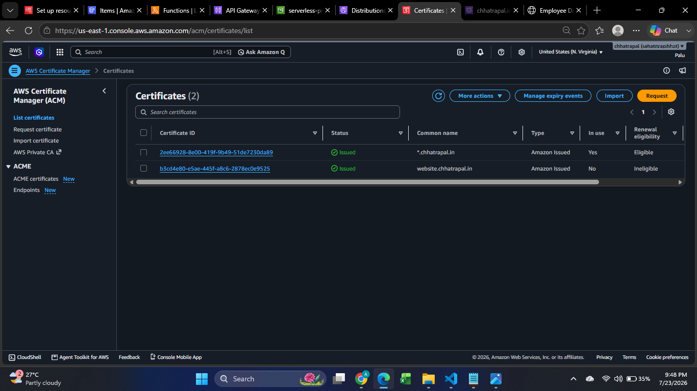
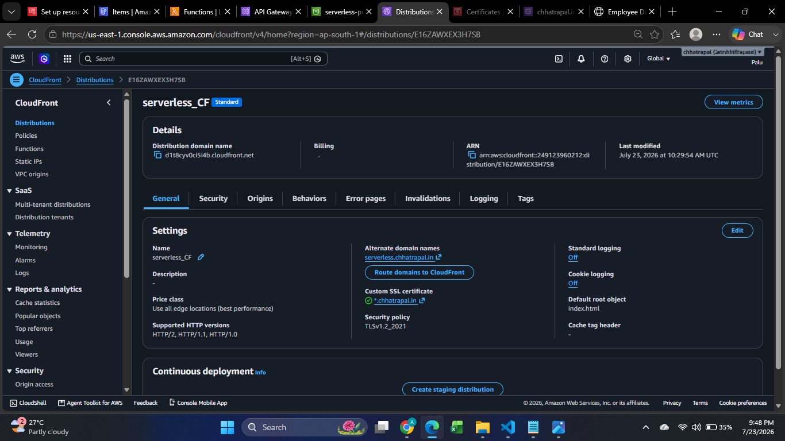
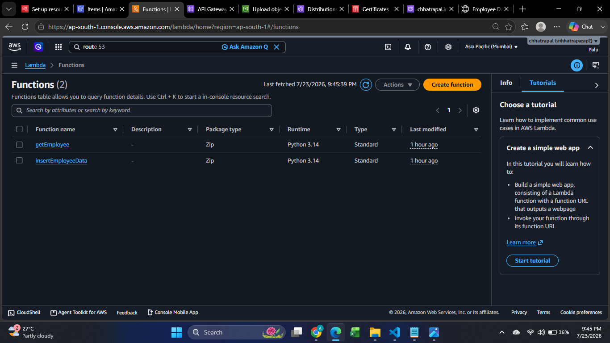
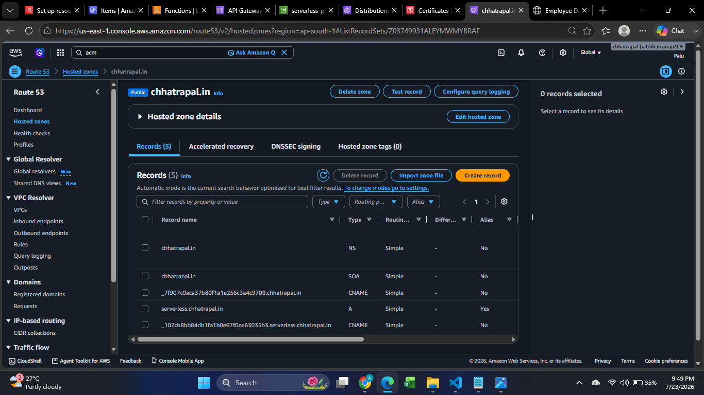
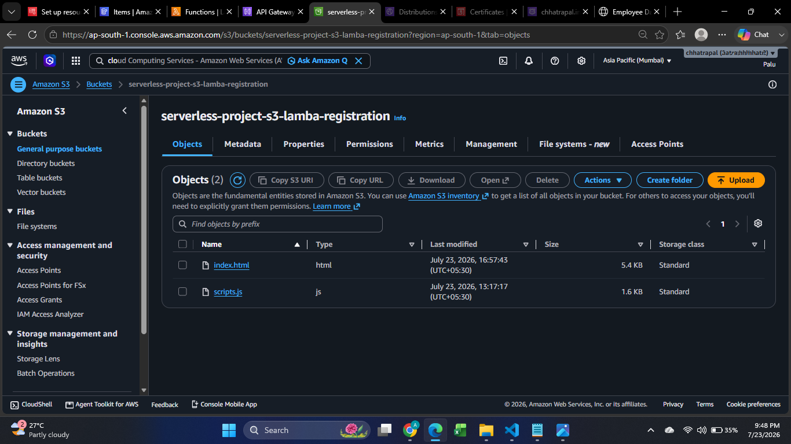

## Live Demo

The application was successfully deployed on AWS using a custom domain and HTTPS.
The live deployment is currently unavailable. Please refer to the architecture diagram and project screenshots included in this repository.

## Project Overview
This project demonstrates a complete AWS Serverless Employee Management System.
The application allows users to add employee details and retrieve all employee records through a REST API.
The frontend is hosted on Amazon S3 and delivered globally using Amazon CloudFront with a custom domain configured through Amazon Route 53. The backend is completely serverless using Amazon API Gateway, AWS Lambda and Amazon DynamoDB.

## AWS Services Used

| Amazon S3          | Static Website Hosting   |

| Amazon CloudFront  | Content Delivery Network |

| Amazon Route 53    | Custom Domain            |

| Amazon API Gateway | REST API                 |

| AWS Lambda         | Backend Compute          |

| Amazon DynamoDB    | NoSQL Database           |

| IAM                | Permissions              |

| ACM                | Certificate              |

## Home Page

## AWS DynamoDB

## Amazon Certificate Manager

## Cloud Frount

## ACM Lambda Function

## AWS Rout53

## AWS S3

## Features
- Add Employee
- View All Employees
- REST API Integration
- Serverless Backend
- Custom Domain
- HTTPS Enabled
- CloudFront CDN
- Private S3 Bucket
- DynamoDB Storage

## Author
** Chhatrapal Janghel **
AWS Cloud & DevOps Engineer
LinkedIn:
GitHub:
Portfolio:
